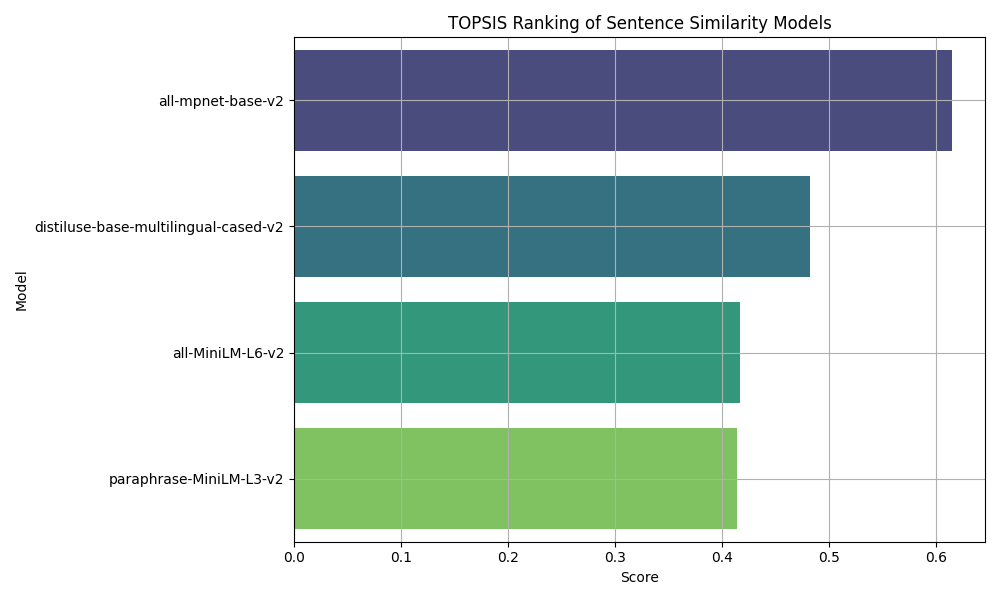

# 🧠 TOPSIS-Based Ranking of Sentence Similarity Models

This project evaluates and ranks multiple pre-trained sentence similarity models using the **TOPSIS (Technique for Order Preference by Similarity to Ideal Solution)** method. It applies quantitative metrics like **MSE**, **R² Score**, and **Execution Time** to determine the best-performing model for sentence-pair similarity tasks.

---

## 📌 Objective

To identify the most effective pre-trained model for computing sentence similarity by:
- Generating similarity scores using sentence embeddings
- Evaluating performance against ground truth
- Ranking models using the TOPSIS method

---

## 📚 Dataset

A small benchmark dataset of sentence pairs with human-labeled similarity scores is used:

```plaintext
Example:
("A man is eating food.", "A man is eating a piece of bread.", 0.8)
```

You can easily replace this dataset with the STS Benchmark or any other sentence similarity dataset for better evaluation.

---

## 🔍 Models Compared

- `all-MiniLM-L6-v2`
- `all-mpnet-base-v2`
- `paraphrase-MiniLM-L3-v2`
- `distiluse-base-multilingual-cased-v2`

These models are sourced from [Sentence-Transformers](https://www.sbert.net/).

---

## ⚙️ Methodology

1. **Sentence Encoding**: Embeddings are generated using each model.
2. **Similarity Computation**: Cosine similarity is computed for sentence pairs.
3. **Performance Evaluation**:
    - Mean Squared Error (MSE)
    - R² Score
    - Time Taken
4. **Multi-Criteria Decision Making**:
    - Normalization using Min-Max
    - Equal weight assignment
    - TOPSIS score and final model ranking

---

## 📊 Output


The bar chart above shows the TOPSIS scores of the evaluated models.

---

## 📝 Usage

1. Clone the repo:

```bash
git clone https://github.com/your-username/topsis-sentence-similarity.git
cd topsis-sentence-similarity
```

2. Install dependencies:

```bash
pip install -r requirements.txt
```

3. Open the notebook:

```bash
jupyter notebook topsis_sentence_similarity.ipynb
```

---

## 📦 Dependencies

- `sentence-transformers`
- `numpy`
- `pandas`
- `scikit-learn`
- `matplotlib`
- `seaborn`

> 📌 Make sure to save the ranking image as `topsis_ranking.png` in the same directory.

---

## 📈 Results Table

| Model                               | MSE       | R²        | Time (s) | TOPSIS Score | Rank |
|-------------------------------------|-----------|-----------|----------|---------------|------|
| all-mpnet-base-v2                   | 0.009022  | 0.915204  | 0.973820 | 0.615132      | 1    |
| distiluse-base-multilingual-cased-v2| 0.022421  | 0.789276  | 0.483381 | 0.482412      | 2    |
| all-MiniLM-L6-v2                    | 0.010444  | 0.901843  | 0.312203 | 0.416660      | 3    |
| paraphrase-MiniLM-L3-v2             | 0.004967  | 0.953319  | 0.140276 | 0.414214      | 4    |

## 🖼️ Graph


